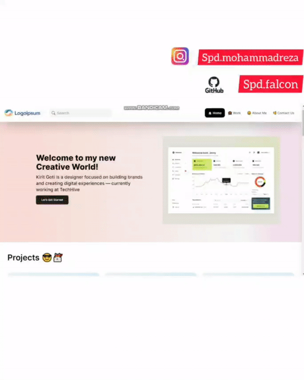

</img>
<a href="https://ibb.co/0qkmkpJ"></a> <a href="https://ibb.co/WzWDJQ0"></a>
<a href="https://ibb.co/N71ZKp7"></a>
<a href="https://ibb.co/s9ycnnW"></a>
<!-- TABLE OF CONTENTS -->
<details>
  <summary>Table of Contents</summary>
  <ol>
    <li>
      <a href="#about-the-project">About The Project</a>
      <ul>
        <li><a href="#built-with">Built With</a></li>
      </ul>
    </li>
    <li>
      <a href="#getting-started">Getting Started</a>
      <ul>
        <li><a href="#prerequisites">Prerequisites</a></li>
        <li><a href="#installation">Installation</a></li>
      </ul>
    </li>
  </ol>
</details>


<!-- ABOUT THE PROJECT -->
## About The Project

This is a portfolio project with a lot of attractive features and the use of functional libraries such as Redux and Axios!
[Project Deployed Link - View the project](https://personal-portfolio-kappa-flax.vercel.app/)

Project features:
* Fully responsive
* Using Json-Server backend
* Detailed implementation

### Built With

This project is developed using very useful and large libraries

* 
* 
* 
* 
* 
* 

<!-- GETTING STARTED -->
## Getting Started

Now let's run the project on our system

### Prerequisites

You must have npm package manager on your system
With the nodejs port, this package manager will be installed for you

### Installation

_Follow the steps below to install and run._

1. Clone the repo
   ```sh
   git clone https://github.com/rezaeiar/personal-portfolio.git
   ```
2. Go to the path of the added project
   ```sh
   cd personal-portfolio
   ```
3. Install dependencies
   ```sh
   npm install
   ```
4. Run the project
   ```sh
   npm run dev
   ```
